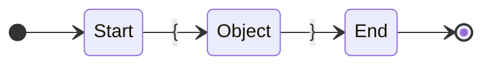

## Json Structure

```
json       -> { Whitespace objects Whitespace }
objects    -> objects Whitespace , Whitespace object | object
object     -> key Whitespace : Whitespace value
key        -> string
value      -> list | json | number | string | true | false | null
string     -> "..."
number     ->
list       -> [ Whitespace item Whitespace ]
item       -> item Whitespace , Whitespace value | value
Whitespace -> Whitespace whitespace | whitespace
whitespace -> ' ' | '\t' | '\n'
```
